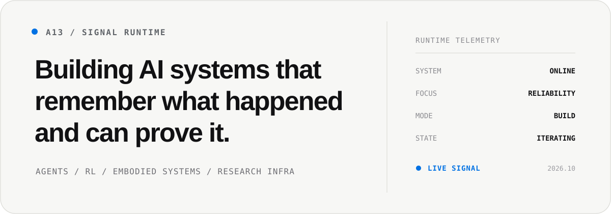
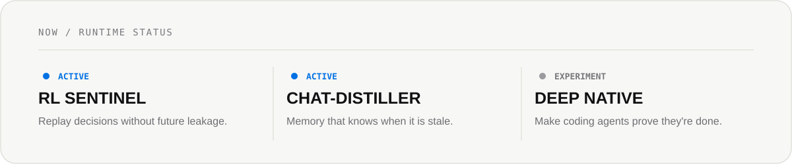
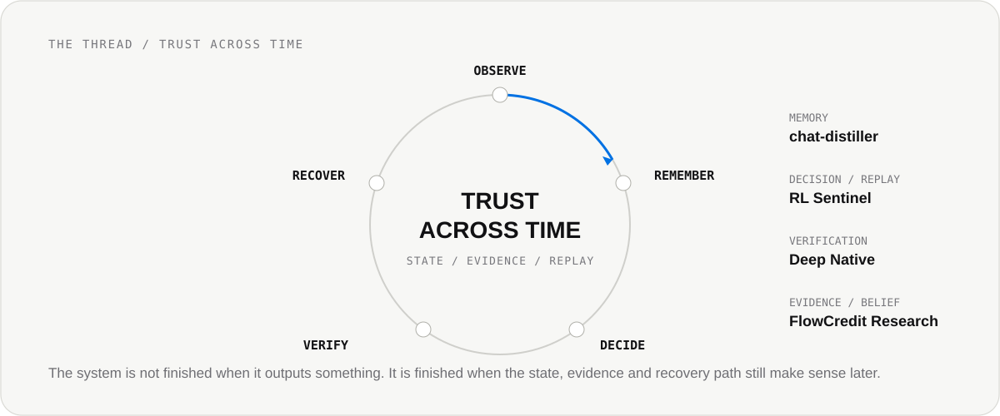

<picture>
  <source media="(prefers-color-scheme: dark)" srcset="assets/profile-hero-v3-dark.svg">
  
</picture>

 

**Evidence-first engineering for agents, learning systems, and research infrastructure.**

STATE / EVIDENCE / VERIFICATION / RECOVERY

---

## Focus

<table>
<tr>
<td width="33%" valign="top">

AGENT SYSTEMS

**Memory / Runtime / Recovery**

Long-running systems with explicit state, bounded execution, verification, and human authority.

</td>
<td width="33%" valign="top">

RL / ROBOTICS

**Policy / Replay / Control**

PPO, MuJoCo, hierarchical navigation, experiment reliability, and failure analysis.

</td>
<td width="33%" valign="top">

RESEARCH INFRA

**Grounding / Evidence / Change**

Versioned knowledge, inspectable evidence, belief revision, and reproducible decisions.

</td>
</tr>
</table>

## Now

<picture>
  <source media="(prefers-color-scheme: dark)" srcset="assets/runtime-now-dark.svg">
  
</picture>

## Selected systems

<table>
<tr>
<td width="33%" valign="top">

01 / RELIABILITY

### [RL Sentinel ↗](https://github.com/Anhao1314/RL-Sentinel)

Replay what the system knew, not what we know later.

PYTHON / RL / REPLAY

</td>
<td width="33%" valign="top">

02 / EMBODIED RL

### [Go2W MoRA ↗](https://github.com/Anhao1314/Go2w-MoRA-navigation)

Hierarchical navigation for Unitree Go2W in MuJoCo.

PYTORCH / MUJOCO / PPO

</td>
<td width="33%" valign="top">

03 / MEMORY

### [chat-distiller ↗](https://github.com/Anhao1314/chat-distiller)

Versioned memory and knowledge for long-running agents.

PYTHON / MEMORY / RECOVERY

</td>
</tr>
<tr>
<td width="33%" valign="top">

04 / VERIFICATION

### [Deep Native ↗](https://github.com/Anhao1314/deep-native)

Evidence-first execution for coding agents.

CLAUDE CODE / DEEPSEEK / VERIFY

</td>
<td width="33%" valign="top">

05 / RESEARCH MEMORY

### [FlowCredit Research ↗](https://github.com/Anhao1314/flowcredit-research)

Grounded evidence and versioned belief change.

EVIDENCE / CLAIMS / GROUNDING

</td>
<td width="33%" valign="top">

06 / DECISION INFRA

### [FlowCredit ↗](https://github.com/Anhao1314/flowcredit)

Evidence-aware risk infrastructure for AI-native systems.

NODE.JS / RISK / AGENTS

</td>
</tr>
</table>

## The thread

<picture>
  <source media="(prefers-color-scheme: dark)" srcset="assets/system-loop-dark.svg">
  
</picture>

### How do we make AI systems trustworthy across time, not only impressive in a single run?

## Principles

<table>
<tr>
<td width="33%" valign="top">

01 / EVIDENCE

**Evidence over claims.**

Successful-looking output is not proof that the system worked.

</td>
<td width="33%" valign="top">

02 / REPLAY

**Replay before trust.**

Important decisions should be reconstructable from what was available at the time.

</td>
<td width="33%" valign="top">

03 / AUTHORITY

**Human authority above automation.**

Agents may propose, execute, and review. Consequential acceptance stays explicit.

</td>
</tr>
</table>

---

A13 / BUILD SYSTEMS · RUN EXPERIMENTS · KEEP THE RECEIPTS

