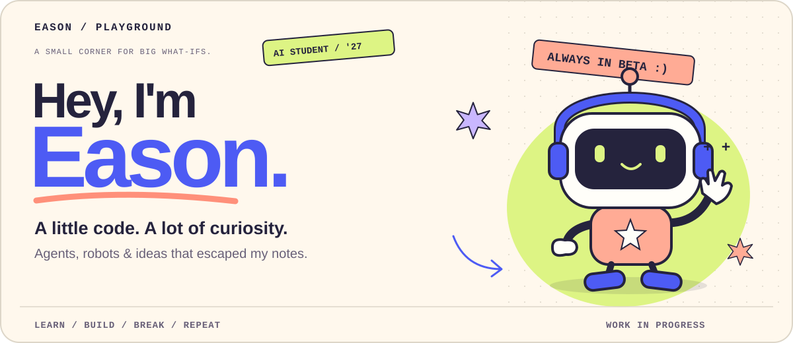
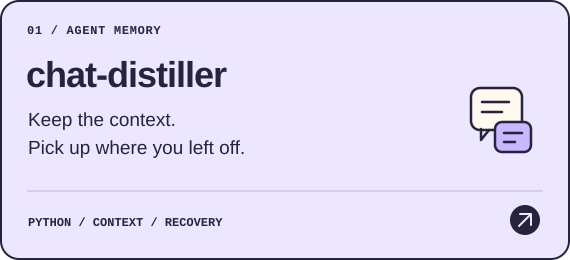
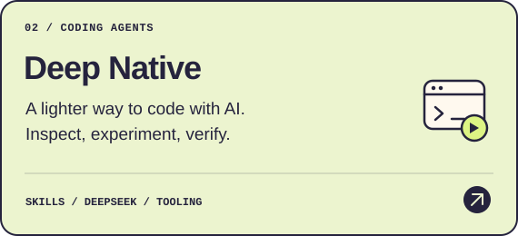
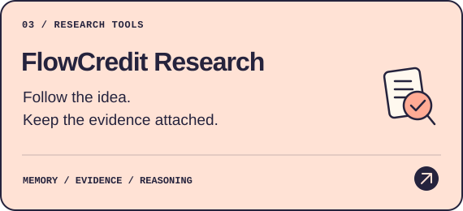
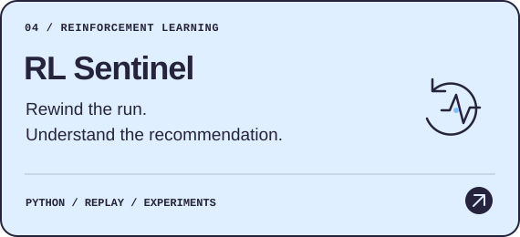
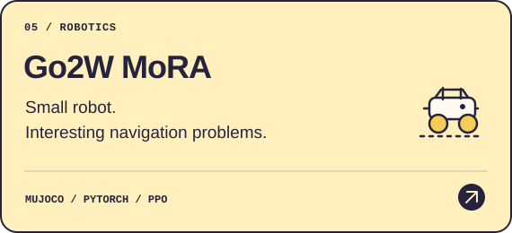
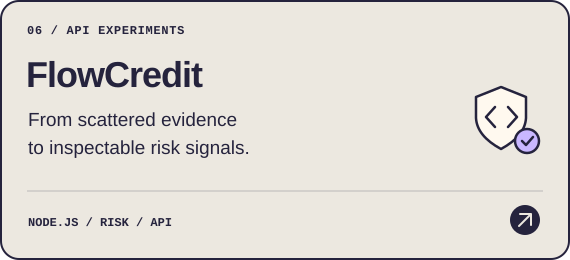

<picture>
  <source media="(prefers-color-scheme: dark) and (prefers-reduced-motion: no-preference)" srcset="assets/playground/hero-dark.svg">
  <source media="(prefers-reduced-motion: no-preference)" srcset="assets/playground/hero-light.svg">
  <source media="(prefers-color-scheme: dark)" srcset="assets/playground/hero-dark-static.svg">
  
</picture>

  <a href="#things-ive-built">✳ Things I've built</a> &nbsp; · &nbsp;
  <a href="#currently-messing-with">⚡ On my desk</a> &nbsp; · &nbsp;
  <a href="#side-quests">🎮 Side quests</a>

I'm an **AI undergraduate, graduating in 2027**. I like turning “what happens if…” into something I can run, break, and improve.

My current rabbit holes: **AI agents, reinforcement learning, and robots**. Still learning. Still changing my mind. Building along the way.

## ✳ Things I've built

Six projects, a few rabbit holes. Pick a cover and take a look inside.

  
  

  
  

  
  

📎 Prefer a text-only project index?

| Project | What I'm exploring |
| :--- | :--- |
| [chat-distiller](https://github.com/Anhao1314/chat-distiller) | Keeping useful context across long-running agent work. |
| [Deep Native](https://github.com/Anhao1314/deep-native) | Lighter coding-agent behavior, tested instead of assumed. |
| [FlowCredit Research](https://github.com/Anhao1314/flowcredit-research) | Research memory that keeps the evidence attached. |
| [RL Sentinel](https://github.com/Anhao1314/RL-Sentinel) | Replaying what was known when a recommendation was made. |
| [Go2W MoRA](https://github.com/Anhao1314/Go2w-MoRA-navigation) | Hierarchical robot navigation in simulation. |
| [FlowCredit](https://github.com/Anhao1314/flowcredit) | Inspectable evidence and deterministic risk signals through an API. |

## ⚡ Currently messing with

**🤖 Robots that can handle a plan going wrong.**  
[G1 mission experiments](https://github.com/Anhao1314/g1-jev-swarm-lab): structured tasks, measured outcomes, and failure handling in MuJoCo. Simulation research, not a claim of real-world robot safety.

**🧠 An agent that doesn't lose the thread.**  
[chat-distiller](https://github.com/Anhao1314/chat-distiller): bringing the right decisions and context back when work spans conversations.

**🛠️ Doing less, checking better.**  
[Deep Native](https://github.com/Anhao1314/deep-native): experimenting with how much process a coding task actually needs. The first pilot did not show a quality improvement; that result stays visible.

A hand-curated workbench, not a live activity feed. The linked repositories are the source of truth.

## 🎮 Side quests

Open the other tabs in my brain ↗

**Creative coding · AI visuals · Small tools · Interface experiments**

Not every idea needs to become a startup. Some are worth building just to see what happens.

我还是学生。想把好奇心变成能跑起来的东西，也想把它们做得好看一点。

🧪 Playful outside. A little more serious under the hood.

I want the experiments to be fun and the claims to be honest.

**Keep the failed runs. Link the evidence. Say what isn't working yet.**

The project repositories hold the protocols, limitations and results. This profile is a way in, not a substitute for them.

🤖 About the little robot & this page

The robot is an original geometric SVG illustration, not a photo or a product screenshot. It floats, blinks and settles in under five seconds. Motion is decorative; it does not indicate that an agent is online.

This page uses repository-hosted artwork, ordinary links and native disclosure panels. No tracking widgets, external font requests, made-up metrics, or JavaScript pretending to work in a README.

Motion-sensitive readers get a static cover when their browser exposes the reduced-motion preference. Static covers are also available directly: [light](assets/playground/hero-light-static.svg) · [dark](assets/playground/hero-dark-static.svg).

[Design & maintenance notes](docs/profile-design.md)

---

<b>Curiosity first. Keep building. ✳</b> Eason / Anhao1314 · Learning in public.

