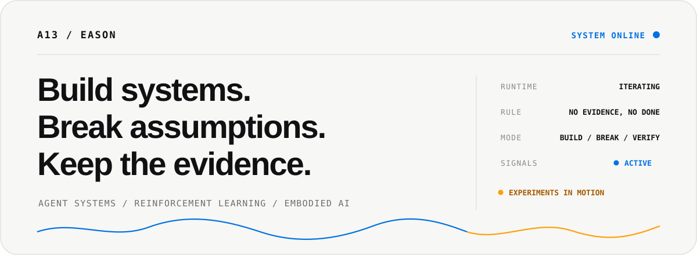
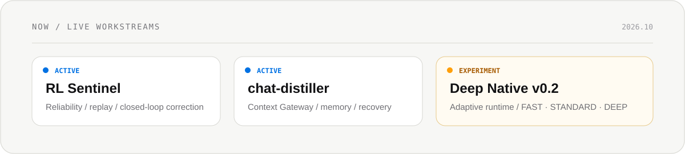

<picture>
  <source media="(prefers-color-scheme: dark)" srcset="assets/profile-hero-v4-dark.svg">
  
</picture>

 

**Reliable AI systems for long-running agents, learning loops, and research work.**

I like systems that can explain themselves after something goes wrong.

---

## Focus

<table>
<tr>
<td width="33%" valign="top">

AGENT SYSTEMS

### Memory / Runtime / Recovery

Long-running agents with explicit state, bounded execution, verification, and human authority.

</td>
<td width="33%" valign="top">

RL / ROBOTICS

### Policy / Replay / Control

PPO, MuJoCo, hierarchical navigation, experiment reliability, and failure analysis.

</td>
<td width="33%" valign="top">

RESEARCH INFRA

### Grounding / Evidence / Change

Versioned knowledge, inspectable evidence, belief revision, and reproducible decisions.

</td>
</tr>
</table>

## Now

<picture>
  <source media="(prefers-color-scheme: dark)" srcset="assets/runtime-now-v4-dark.svg">
  
</picture>

## Selected systems

<table>
<tr>
<td width="62%" valign="top">

01 / FLAGSHIP / RELIABILITY

## [RL Sentinel ↗](https://github.com/Anhao1314/RL-Sentinel)

**Replay what the system knew, not what we know later.**

A reliability layer for reinforcement-learning experiments: chronological replay, time-gated inputs, evidence bundles, failure analysis, and explicit limits.

PYTHON / RL / REPLAY / EXPERIMENT RELIABILITY

</td>
<td width="38%" valign="top">

02 / EMBODIED RL

### [Go2W MoRA ↗](https://github.com/Anhao1314/Go2w-MoRA-navigation)

Hierarchical navigation for Unitree Go2W in MuJoCo.

PYTORCH / MUJOCO / PPO

</td>
</tr>
<tr>
<td width="38%" valign="top">

03 / MEMORY

### [chat-distiller ↗](https://github.com/Anhao1314/chat-distiller)

Versioned memory, stale detection, and recovery context for long-running agents.

PYTHON / MEMORY / RECOVERY

</td>
<td width="62%" valign="top">

04 / FLAGSHIP / VERIFICATION

## [Deep Native ↗](https://github.com/Anhao1314/deep-native)

**Make coding agents prove they're done.**

Evidence-first execution for coding agents, now exploring adaptive FAST / STANDARD / DEEP escalation without hiding verification failure.

CLAUDE CODE / DEEPSEEK / VERIFICATION / ADAPTIVE RUNTIME

</td>
</tr>
<tr>
<td width="56%" valign="top">

05 / RESEARCH MEMORY

### [FlowCredit Research ↗](https://github.com/Anhao1314/flowcredit-research)

Grounded evidence, versioned claims, explicit relations, and human-reviewed belief change.

EVIDENCE / CLAIMS / GROUNDING

</td>
<td width="44%" valign="top">

06 / DECISION INFRA

### [FlowCredit ↗](https://github.com/Anhao1314/flowcredit)

Evidence-aware risk infrastructure for AI-native systems.

NODE.JS / RISK / AGENTS

</td>
</tr>
</table>

## Recent signals

**2026.10.06 · [FlowCredit Research](https://github.com/Anhao1314/flowcredit-research)**  
<code>SAFETY / AUDIT</code> — hardened v0.2C S1 safety-audit integrity without changing runtime, benchmark labels, or thresholds.

**2026.10.06 · [Deep Native](https://github.com/Anhao1314/deep-native)**  
<code>EXPERIMENT / V0.2</code> — added an adaptive runtime candidate with FAST / STANDARD / DEEP escalation and held-out ablation planning.

**2026.10.06 · [chat-distiller](https://github.com/Anhao1314/chat-distiller)**  
<code>MEMORY / V0.4</code> — added Context Gateway 0.4 for a lower-friction connect → sync → context → status path.

**2026.10.06 · [RL Sentinel](https://github.com/Anhao1314/RL-Sentinel)**  
<code>RELIABILITY / DOCS</code> — refined the project identity and reading experience while preserving runtime APIs and historical evidence.

## The thread

<picture>
  <source media="(prefers-color-scheme: dark)" srcset="assets/system-loop-dark.svg">
  
</picture>

### Trust is not a model output. It is a system property you have to keep earning.

## Principles

<table>
<tr>
<td width="33%" valign="top">

01 / EVIDENCE

**Evidence over claims.**

A successful-looking output is not proof.

</td>
<td width="33%" valign="top">

02 / REPLAY

**Replay before trust.**

Important decisions should survive reconstruction.

</td>
<td width="33%" valign="top">

03 / AUTHORITY

**Human authority above automation.**

Agents can propose and execute. Acceptance stays explicit.

</td>
</tr>
</table>

---

A13 / BUILD · BREAK · VERIFY · REPEAT

