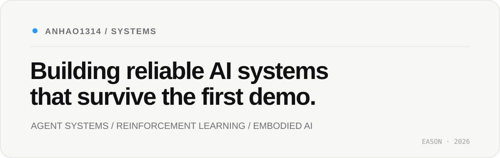
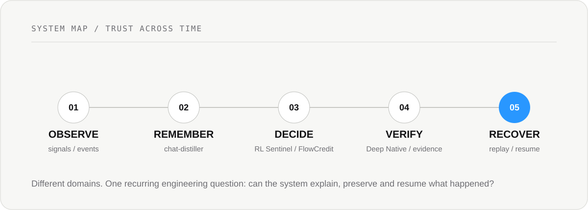

<picture>
  <source media="(prefers-color-scheme: dark)" srcset="assets/profile-hero-dark.svg">
  
</picture>

 

**Evidence-first engineering for long-running agents, learning systems, and research infrastructure.**

STATE · EVIDENCE · VERIFICATION · RECOVERY

---

## 01 / Focus

<table>
<tr>
<td width="33%" valign="top">

**AGENT SYSTEMS**

Memory · Runtime · Recovery  
Verification · Human authority

</td>
<td width="33%" valign="top">

**RL / ROBOTICS**

PPO · MuJoCo · Replay  
Hierarchical control

</td>
<td width="33%" valign="top">

**RESEARCH INFRA**

Grounding · Evidence  
Versioned knowledge

</td>
</tr>
</table>

## 02 / Now

| System | Status | Current question |
| --- | :---: | --- |
| **[RL Sentinel](https://github.com/Anhao1314/RL-Sentinel)** | `ACTIVE` | Can an RL decision be replayed using only what was knowable at the time? |
| **[chat-distiller](https://github.com/Anhao1314/chat-distiller)** | `ACTIVE` | How should long-running agents preserve decisions and recover useful context? |
| **[Deep Native](https://github.com/Anhao1314/deep-native)** | `EXPERIMENT` | Can coding agents be required to verify before they declare success? |

## 03 / Selected systems

<table>
<tr>
<td width="50%" valign="top">

01 / RELIABILITY

### [RL Sentinel](https://github.com/Anhao1314/RL-Sentinel)

Replay what the system knew, not what we know later.

<code>Python</code> <code>RL</code> <code>Replay</code>

</td>
<td width="50%" valign="top">

02 / EMBODIED RL

### [Go2W MoRA Navigation](https://github.com/Anhao1314/Go2w-MoRA-navigation)

Hierarchical navigation for Unitree Go2W in MuJoCo.

<code>PyTorch</code> <code>MuJoCo</code> <code>PPO</code>

</td>
</tr>
<tr>
<td width="50%" valign="top">

03 / MEMORY

### [chat-distiller](https://github.com/Anhao1314/chat-distiller)

Versioned memory and knowledge for long-running agents.

<code>Python</code> <code>Agent Memory</code> <code>Recovery</code>

</td>
<td width="50%" valign="top">

04 / VERIFICATION

### [Deep Native](https://github.com/Anhao1314/deep-native)

Evidence-first execution for coding agents.

<code>Claude Code</code> <code>DeepSeek</code> <code>Verification</code>

</td>
</tr>
<tr>
<td width="50%" valign="top">

05 / RESEARCH MEMORY

### [FlowCredit Research](https://github.com/Anhao1314/flowcredit-research)

Grounded evidence and versioned belief change.

<code>Evidence</code> <code>Claims</code> <code>Grounding</code>

</td>
<td width="50%" valign="top">

06 / DECISION INFRA

### [FlowCredit](https://github.com/Anhao1314/flowcredit)

Evidence-aware risk infrastructure for AI-native systems.

<code>Node.js</code> <code>Risk</code> <code>Agents</code>

</td>
</tr>
</table>

## 04 / System map

<picture>
  <source media="(prefers-color-scheme: dark)" srcset="assets/system-map-dark.svg">
  
</picture>

> **How do we make AI systems trustworthy across time, not only impressive in a single run?**

## 05 / Principles

**Evidence over claims.** Successful-looking output is not proof.

**Replay before trust.** Important decisions should be reconstructable from the information available at the time.

**Human authority above automation.** Agents can propose, execute, and review; consequential acceptance stays explicit.

---

BUILD SYSTEMS · RUN EXPERIMENTS · KEEP THE RECEIPTS

